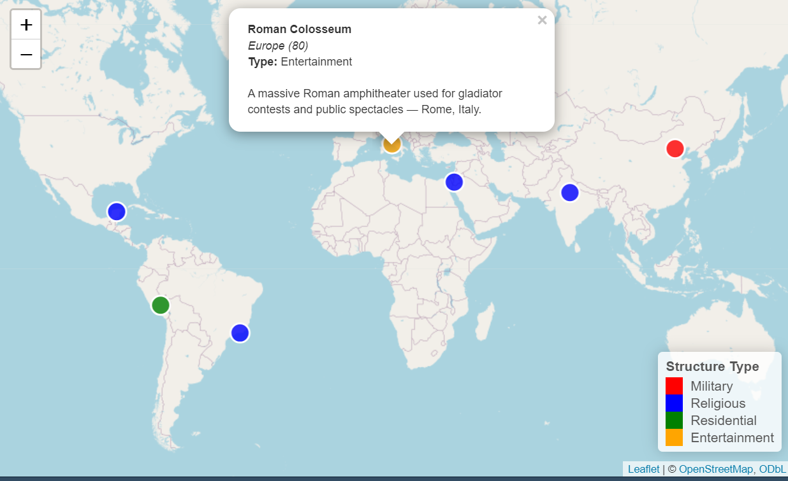
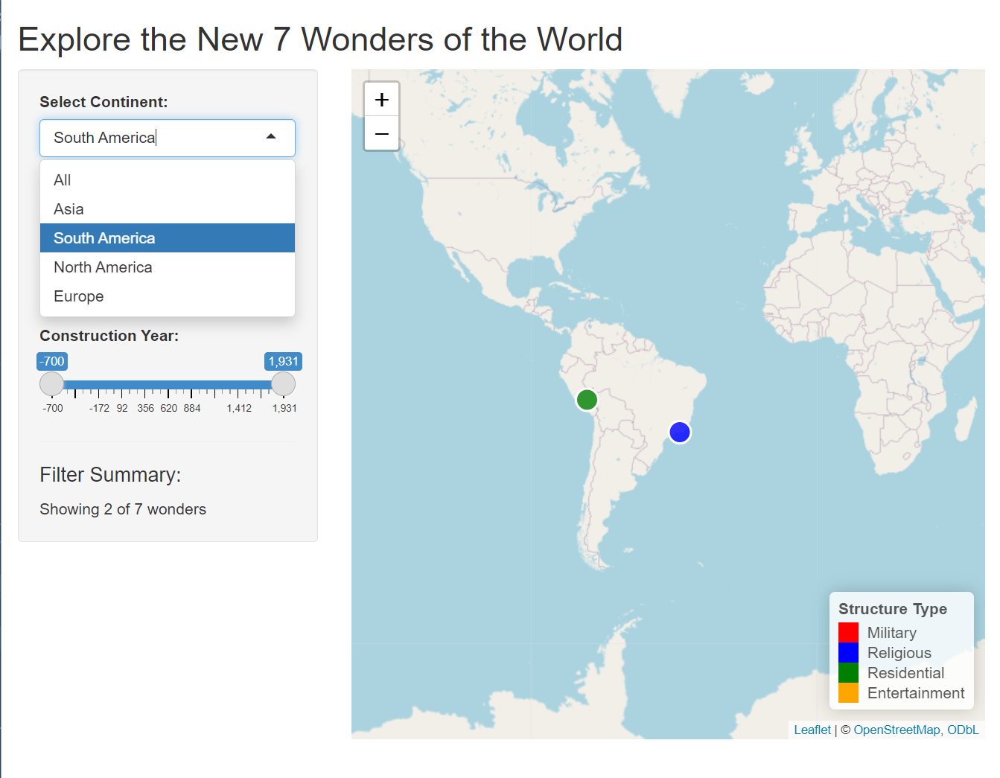

```{r, include = FALSE}
knitr::opts_chunk$set(
  collapse = TRUE,
  comment = "#>"
)
```

```{r setup}
library(sevenworldwonders)
```

## Introduction

In this vignette, I will discuss the functionality of the R package 
sevenworldwonders, which provides an interactive Shiny application to explore the New Seven Wonders of the World through geographic visualization and filtering. The package contains three main functions that work together to create an educational mapping experience.

1. world_wonders_data() -> Data retrieval.
2. create_wonders_map() -> Map visualization.
3. run_wonders_app() -> Shiny app application interface.

## Requirements

- R version 3.5 or higher
- Packages: shiny, leaflet, dplyr
- Internet connection


## Installation

``` {r, eval = FALSE}
devtools::install_github("Programming-The-Next-Step-2025/seven-world-wonders")
```


## Seven World Wonders Dataset

The world_wonders_data() function returns a  dataset about each wonder. 

```{r, eval = FALSE}
wonders <- world_wonders_data()
print(wonders)
```
The dataset includes geographic coordinates, continent, structure types (Military, Religious, Residential, Entertainment), and construction years spanning from 700 
BCE to 1931 CE. Each wonder also contains descriptions. This  dataset allows for 
both visualization and filtering capabilities in the interactive app. 


## Creating the Wonders Map

The create_wonders_map() function generates an interactive leaflet map with 
color-coded markers representing different structure types. Each marker displays detailed information when clicked.

```{r, eval = FALSE}
map <- create_wonders_map(wonders)
map
```
{width=600px}

***Color***
The function has a  color-coding system which uses an internal helper function
that assigns colors based on structure type.
This creates a system where red represents military structures, blue for 
religious structures, green for residential structures, and orange for 
entertainment structures.

***Popup***
The function creates popups which include the wonder name in bold formatting, continent in italics, construction year in italics, structure type, and a description.For construction year, the values that have a minus before the number means that it is BCE.

***Legend***
The function generates a legend that explain the color-coding system in the 
bottom-right corener.


## The Shiny Seven World Wonders App

The run_wonders_app() function launches the full interactive application:
``` {r, eval = FALSE}
run_wonders_app()
```

***The application provides three filtering options:***

1. Continent Filter: A dropdown that allows users to focus on 
specific geographic regions or view all wonders simultaneously.

2. Structure Type Filter: A checkbox that enables multiple selections,
allowing users to compare different types of structures.

3. Construction Year Filter: A dual-handle slider that filters wonders by 
construction period.

## Example on how to use the app

People can use the interactive map to filter for continents, and analyse 
how many wonders there are in a specific continent. The screenshot below displays the filter for South America, wonders only in South America. In the filter summary box, you can see how many wonders are there for the specific filter. In this case, there are two out of seven world wonders in South America.

This is a great app to learn more about the new seven world wonders!

{width=600px}


